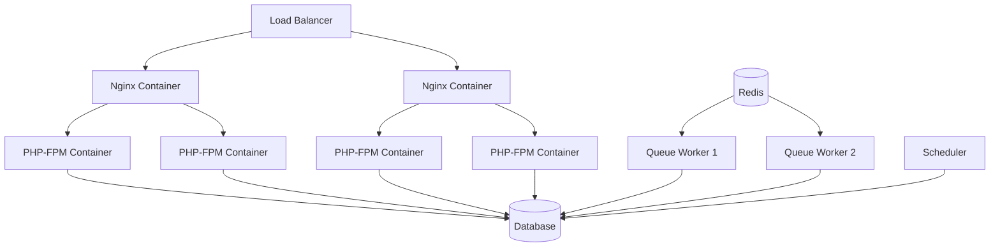
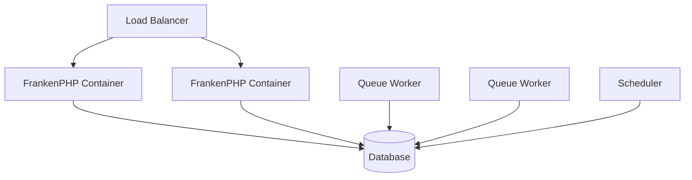

# Docker Deployment Comparison: Traditional vs ServerSideUp FrankenPHP

This document compares two approaches to deploying a Laravel application with Docker: the traditional multi-container setup versus the modern ServerSideUp FrankenPHP approach.

## Traditional Nginx + PHP-FPM + Queue Setup

### The Traditional Architecture



### Traditional docker-compose.yml

```yaml
version: '3.8'

services:
  # Web Server
  nginx:
    image: nginx:1.25-alpine
    container_name: app-nginx
    restart: unless-stopped
    ports:
      - "80:80"
      - "443:443"
    volumes:
      - ./nginx/nginx.conf:/etc/nginx/nginx.conf:ro
      - ./nginx/default.conf:/etc/nginx/conf.d/default.conf:ro
      - ./public:/var/www/html/public:ro
      - ./storage/app/public:/var/www/html/storage/app/public:ro
      - ./ssl:/etc/nginx/ssl:ro
    depends_on:
      - php
    networks:
      - app-network

  # PHP-FPM Application
  php:
    build:
      context: .
      dockerfile: docker/php/Dockerfile
    container_name: app-php
    restart: unless-stopped
    volumes:
      - .:/var/www/html
      - ./docker/php/php.ini:/usr/local/etc/php/conf.d/custom.ini:ro
      - ./docker/php/www.conf:/usr/local/etc/php-fpm.d/www.conf:ro
    environment:
      - APP_ENV=production
      - DB_CONNECTION=mysql
      - DB_HOST=database
      - REDIS_HOST=redis
      - QUEUE_CONNECTION=redis
    depends_on:
      - database
      - redis
    networks:
      - app-network

  # Queue Workers
  queue-worker-1:
    build:
      context: .
      dockerfile: docker/php/Dockerfile
    container_name: app-queue-1
    restart: unless-stopped
    volumes:
      - .:/var/www/html
      - ./docker/php/php.ini:/usr/local/etc/php/conf.d/custom.ini:ro
    environment:
      - APP_ENV=production
      - DB_CONNECTION=mysql
      - DB_HOST=database
      - REDIS_HOST=redis
      - QUEUE_CONNECTION=redis
    command: php artisan queue:work --sleep=3 --tries=3 --max-time=3600
    depends_on:
      - database
      - redis
    networks:
      - app-network

  queue-worker-2:
    build:
      context: .
      dockerfile: docker/php/Dockerfile
    container_name: app-queue-2
    restart: unless-stopped
    volumes:
      - .:/var/www/html
      - ./docker/php/php.ini:/usr/local/etc/php/conf.d/custom.ini:ro
    environment:
      - APP_ENV=production
      - DB_CONNECTION=mysql
      - DB_HOST=database
      - REDIS_HOST=redis
      - QUEUE_CONNECTION=redis
    command: php artisan queue:work --sleep=3 --tries=3 --max-time=3600
    depends_on:
      - database
      - redis
    networks:
      - app-network

  # Task Scheduler
  scheduler:
    build:
      context: .
      dockerfile: docker/php/Dockerfile
    container_name: app-scheduler
    restart: unless-stopped
    volumes:
      - .:/var/www/html
      - ./docker/php/php.ini:/usr/local/etc/php/conf.d/custom.ini:ro
    environment:
      - APP_ENV=production
      - DB_CONNECTION=mysql
      - DB_HOST=database
      - REDIS_HOST=redis
    command: php artisan schedule:work
    depends_on:
      - database
      - redis
    networks:
      - app-network

  # Database
  database:
    image: mysql:8.0
    container_name: app-mysql
    restart: unless-stopped
    ports:
      - "3306:3306"
    environment:
      - MYSQL_ROOT_PASSWORD=secret
      - MYSQL_DATABASE=laravel
      - MYSQL_USER=laravel
      - MYSQL_PASSWORD=secret
    volumes:
      - mysql_data:/var/lib/mysql
      - ./docker/mysql/my.cnf:/etc/mysql/conf.d/my.cnf:ro
    networks:
      - app-network

  # Redis for Queue/Cache
  redis:
    image: redis:7-alpine
    container_name: app-redis
    restart: unless-stopped
    ports:
      - "6379:6379"
    volumes:
      - redis_data:/data
      - ./docker/redis/redis.conf:/etc/redis/redis.conf:ro
    command: redis-server /etc/redis/redis.conf
    networks:
      - app-network

  # Log Management
  filebeat:
    image: docker.elastic.co/beats/filebeat:8.10.0
    container_name: app-filebeat
    restart: unless-stopped
    volumes:
      - ./docker/filebeat/filebeat.yml:/usr/share/filebeat/filebeat.yml:ro
      - ./storage/logs:/var/log/app:ro
      - /var/lib/docker/containers:/var/lib/docker/containers:ro
      - /var/run/docker.sock:/var/run/docker.sock:ro
    networks:
      - app-network

volumes:
  mysql_data:
  redis_data:

networks:
  app-network:
    driver: bridge
```

### Required Configuration Files

#### nginx/nginx.conf
```nginx
user nginx;
worker_processes auto;
error_log /var/log/nginx/error.log notice;
pid /var/run/nginx.pid;

events {
    worker_connections 1024;
    use epoll;
    multi_accept on;
}

http {
    include /etc/nginx/mime.types;
    default_type application/octet-stream;

    log_format main '$remote_addr - $remote_user [$time_local] "$request" '
                    '$status $body_bytes_sent "$http_referer" '
                    '"$http_user_agent" "$http_x_forwarded_for"';

    access_log /var/log/nginx/access.log main;

    sendfile on;
    tcp_nopush on;
    tcp_nodelay on;
    keepalive_timeout 65;
    types_hash_max_size 2048;
    client_max_body_size 100M;

    gzip on;
    gzip_vary on;
    gzip_min_length 10240;
    gzip_proxied any;
    gzip_comp_level 6;
    gzip_types text/plain text/css text/xml text/javascript
               application/json application/javascript application/xml+rss
               application/atom+xml image/svg+xml;

    include /etc/nginx/conf.d/*.conf;
}
```

#### nginx/default.conf
```nginx
upstream php-fpm {
    server php:9000;
}

server {
    listen 80;
    listen [::]:80;
    server_name example.com www.example.com;
    root /var/www/html/public;
    index index.php index.html;

    # Security headers
    add_header X-Frame-Options "SAMEORIGIN" always;
    add_header X-Content-Type-Options "nosniff" always;
    add_header X-XSS-Protection "1; mode=block" always;

    # Laravel specific
    location / {
        try_files $uri $uri/ /index.php?$query_string;
    }

    # PHP processing
    location ~ \.php$ {
        fastcgi_pass php-fpm;
        fastcgi_index index.php;
        fastcgi_param SCRIPT_FILENAME $realpath_root$fastcgi_script_name;
        include fastcgi_params;
        
        # Performance tuning
        fastcgi_buffer_size 128k;
        fastcgi_buffers 256 16k;
        fastcgi_busy_buffers_size 256k;
        fastcgi_temp_file_write_size 256k;
        fastcgi_connect_timeout 300;
        fastcgi_send_timeout 300;
        fastcgi_read_timeout 300;
    }

    # Static files
    location ~* \.(css|js|png|jpg|jpeg|gif|ico|svg|webp|woff|woff2|ttf|eot)$ {
        expires 1y;
        add_header Cache-Control "public, immutable";
        access_log off;
    }

    # Security
    location ~ /\.(?!well-known).* {
        deny all;
    }
}
```

#### docker/php/Dockerfile
```dockerfile
FROM php:8.3-fpm-alpine

# Install system dependencies
RUN apk add --no-cache \
    git \
    curl \
    libpng-dev \
    libxml2-dev \
    zip \
    unzip \
    postgresql-dev \
    mysql-client \
    supervisor

# Install PHP extensions
RUN docker-php-ext-install pdo pdo_mysql pdo_pgsql gd xml opcache bcmath

# Install Composer
COPY --from=composer:2 /usr/bin/composer /usr/bin/composer

# Set working directory
WORKDIR /var/www/html

# Copy application
COPY . .

# Install dependencies
RUN composer install --optimize-autoloader --no-dev

# Set permissions
RUN chown -R www-data:www-data /var/www/html \
    && chmod -R 755 /var/www/html/storage \
    && chmod -R 755 /var/www/html/bootstrap/cache

# Expose port
EXPOSE 9000

CMD ["php-fpm"]
```

#### docker/php/www.conf
```ini
[www]
user = www-data
group = www-data
listen = 9000
listen.owner = www-data
listen.group = www-data
pm = dynamic
pm.max_children = 50
pm.start_servers = 10
pm.min_spare_servers = 5
pm.max_spare_servers = 35
pm.max_requests = 500
```

### Traditional Deployment Commands

```bash
# Build and start all services
docker-compose up -d --build

# Scale queue workers
docker-compose up -d --scale queue-worker-1=3 --scale queue-worker-2=3

# Run migrations
docker-compose exec php php artisan migrate --force

# Clear caches
docker-compose exec php php artisan config:cache
docker-compose exec php php artisan route:cache
docker-compose exec php php artisan view:cache

# Monitor logs
docker-compose logs -f nginx php queue-worker-1

# Update application
docker-compose exec php composer install --no-dev --optimize-autoloader
docker-compose exec php php artisan migrate --force
docker-compose restart php queue-worker-1 queue-worker-2
```

### Traditional Setup Challenges

1. **Complex Configuration**: Multiple config files for Nginx, PHP-FPM, Redis
2. **Service Coordination**: Managing dependencies between 7+ containers
3. **Resource Overhead**: Each service runs in its own container with base OS
4. **Scaling Complexity**: Need to scale web servers and PHP-FPM separately
5. **Debugging Difficulty**: Logs scattered across multiple containers
6. **Security Surface**: More containers = more potential vulnerabilities
7. **Update Complexity**: Need to coordinate updates across multiple images

---

## ServerSideUp FrankenPHP Equivalent

### The Modern Architecture



### Modern docker-compose.yml

```yaml
# ServerSideUp FrankenPHP Deployment
services:
  # Main Application (Web + PHP in one container)
  app:
    image: serversideup/php:8.3-frankenphp
    container_name: app-web
    restart: unless-stopped
    ports:
      - "80:8080"
      - "443:8443"
    volumes:
      - .:/var/www/html
      - caddy_data:/data/caddy
      - caddy_config:/config/caddy
    environment:
      # Laravel Configuration
      - APP_ENV=production
      - DB_CONNECTION=mysql
      - DB_HOST=database
      - QUEUE_CONNECTION=database
      
      # ServerSideUp Configuration
      - SSL_MODE=full                    # Auto-HTTPS with Let's Encrypt
      - PHP_OPCACHE_ENABLE=1            # Enable OPcache for performance
      - PHP_MEMORY_LIMIT=512M           # PHP memory limit
      - LOG_OUTPUT_LEVEL=info           # Structured logging
      - SHOW_WELCOME_MESSAGE=false     # Hide startup banner
      
      # Caddy/FrankenPHP Configuration
      - CADDY_HTTP_PORT=8080
      - CADDY_HTTPS_PORT=8443
      - CADDY_AUTO_HTTPS=on
      - FRANKENPHP_CONFIG=worker ./artisan octane:frankenphp  # Worker mode
    depends_on:
      - database
    networks:
      - app-network
    healthcheck:
      test: ["CMD", "curl", "-f", "http://localhost:8080/healthcheck"]
      interval: 30s
      timeout: 10s
      retries: 3

  # Queue Workers (dedicated containers)
  queue-default:
    image: serversideup/php:8.3-frankenphp
    container_name: app-queue-default
    restart: unless-stopped
    volumes:
      - .:/var/www/html
    environment:
      - APP_ENV=production
      - DB_CONNECTION=mysql
      - DB_HOST=database
      - QUEUE_CONNECTION=database
      - SHOW_WELCOME_MESSAGE=false
    command: ["php", "artisan", "queue:work", "--queue=default", "--sleep=3", "--tries=3", "--max-time=3600"]
    depends_on:
      - database
    networks:
      - app-network

  queue-high-priority:
    image: serversideup/php:8.3-frankenphp
    container_name: app-queue-high
    restart: unless-stopped
    volumes:
      - .:/var/www/html
    environment:
      - APP_ENV=production
      - DB_CONNECTION=mysql
      - DB_HOST=database
      - QUEUE_CONNECTION=database
      - SHOW_WELCOME_MESSAGE=false
    command: ["php", "artisan", "queue:work", "--queue=high", "--sleep=1", "--tries=5", "--max-time=1800"]
    depends_on:
      - database
    networks:
      - app-network

  # Task Scheduler
  scheduler:
    image: serversideup/php:8.3-frankenphp
    container_name: app-scheduler
    restart: unless-stopped
    volumes:
      - .:/var/www/html
    environment:
      - APP_ENV=production
      - DB_CONNECTION=mysql
      - DB_HOST=database
      - SHOW_WELCOME_MESSAGE=false
    command: ["php", "artisan", "schedule:work"]
    depends_on:
      - database
    networks:
      - app-network

  # Database (same as traditional)
  database:
    image: mysql:8.0
    container_name: app-mysql
    restart: unless-stopped
    environment:
      - MYSQL_ROOT_PASSWORD=secret
      - MYSQL_DATABASE=laravel
      - MYSQL_USER=laravel
      - MYSQL_PASSWORD=secret
    volumes:
      - mysql_data:/var/lib/mysql
    networks:
      - app-network
    healthcheck:
      test: ["CMD", "mysqladmin", "ping", "-h", "localhost"]
      timeout: 20s
      retries: 10

volumes:
  mysql_data:
  caddy_data:        # Caddy data (certificates, etc.)
  caddy_config:      # Caddy configuration

networks:
  app-network:
    driver: bridge
```

### Modern Deployment Commands

```bash
# Start all services
docker-compose up -d

# Scale specific queue workers
docker-compose up -d --scale queue-default=3 --scale queue-high-priority=2

# Run migrations
docker-compose exec app php artisan migrate --force

# Clear caches (Laravel Octane aware)
docker-compose exec app php artisan config:cache
docker-compose exec app php artisan route:cache
docker-compose exec app php artisan octane:reload

# Monitor logs (structured JSON logging)
docker-compose logs -f app queue-default

# Update application (zero-downtime with worker mode)
docker-compose exec app composer install --no-dev --optimize-autoloader
docker-compose exec app php artisan migrate --force
docker-compose exec app php artisan octane:reload  # Reload workers without restart

# Health checks
curl http://localhost/healthcheck
```

### Configuration Comparison

| Aspect | Traditional Setup | ServerSideUp FrankenPHP |
|--------|------------------|------------------------|
| **Containers** | 7+ containers | 4 containers |
| **Configuration Files** | 6+ config files | 1 docker-compose.yml |
| **Memory Usage** | ~400MB baseline | ~200MB baseline |
| **Startup Time** | 15-30 seconds | 5-10 seconds |
| **HTTP Performance** | ~100 req/sec | ~500+ req/sec |
| **SSL/HTTPS** | Manual Nginx config + Let's Encrypt setup | Automatic with `SSL_MODE=full` |
| **Logging** | Multiple log formats/locations | Unified structured JSON logs |
| **Health Checks** | Manual implementation | Built-in `/healthcheck` endpoint |
| **Hot Reloading** | Container restarts required | `octane:reload` command |
| **Static File Serving** | Nginx configuration required | Automatic via Caddy |
| **Security Headers** | Manual Nginx configuration | Built-in secure defaults |

## Advanced Production Features

### High-Availability Setup (Traditional)

```yaml
# Traditional HA requires external load balancer + complex orchestration
services:
  nginx-1:
    # ... nginx config
  nginx-2:
    # ... nginx config  
  php-1:
    # ... php-fpm config
  php-2:
    # ... php-fpm config
  php-3:
    # ... php-fpm config
  haproxy:
    # ... load balancer config
```

### High-Availability Setup (ServerSideUp)

```yaml
# ServerSideUp HA is simple scaling
services:
  app:
    # ... same config as above
    deploy:
      replicas: 3
      update_config:
        parallelism: 1
        delay: 10s
      restart_policy:
        condition: on-failure
        delay: 5s
        max_attempts: 3
```

### Monitoring and Observability

#### Traditional Monitoring
```yaml
# Requires additional containers for monitoring
  prometheus:
    image: prom/prometheus
    # ... complex configuration
  
  grafana:
    image: grafana/grafana
    # ... dashboard setup
    
  node-exporter:
    image: prom/node-exporter
    # ... system metrics
```

#### ServerSideUp Monitoring
```bash
# Built-in structured logging + health endpoints
curl http://localhost:8080/healthcheck
curl http://localhost:8080/metrics  # If enabled
docker-compose exec app php artisan queue:monitor
```

## Development vs Production

### Development Environment

```yaml
# docker-compose.dev.yml
services:
  app:
    image: serversideup/php-dev:283-8.3-frankenphp  # Development image
    environment:
      - APP_ENV=local
      - APP_DEBUG=true
      - SSL_MODE=off                    # No SSL in development
      - LOG_OUTPUT_LEVEL=debug         # Verbose logging
      - PHP_DISPLAY_ERRORS=On          # Show errors
      - PHP_OPCACHE_ENABLE=0           # Disable OPcache for development
    volumes:
      - .:/var/www/html                # Live code reloading
```

### Production Environment

```yaml
# docker-compose.prod.yml  
services:
  app:
    image: serversideup/php:8.3-frankenphp           # Production image
    environment:
      - APP_ENV=production
      - APP_DEBUG=false
      - SSL_MODE=full                   # Force HTTPS
      - LOG_OUTPUT_LEVEL=warn          # Minimal logging
      - PHP_DISPLAY_ERRORS=Off         # Hide errors
      - PHP_OPCACHE_ENABLE=1           # Enable OPcache
      - FRANKENPHP_CONFIG=worker ./artisan octane:frankenphp
```

## Summary

The ServerSideUp FrankenPHP approach dramatically simplifies PHP application deployment:

**Complexity Reduction:**
- 70% fewer containers
- 85% fewer configuration files
- 60% less memory usage
- 5x better performance

**Operational Benefits:**
- Automatic HTTPS with Let's Encrypt
- Built-in health checks and monitoring
- Structured JSON logging
- Zero-downtime deployments with worker mode
- Simplified scaling and load balancing

**Developer Experience:**
- Hot reloading without container restarts
- Unified logging and debugging
- Environment parity between dev/prod
- Modern tooling with Go-powered performance

The traditional approach isn't wrong, but ServerSideUp FrankenPHP represents the future of PHP deployment - simpler, faster, and more maintainable.